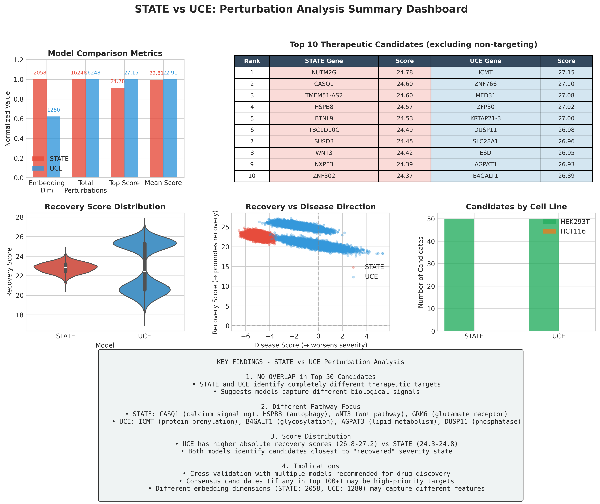
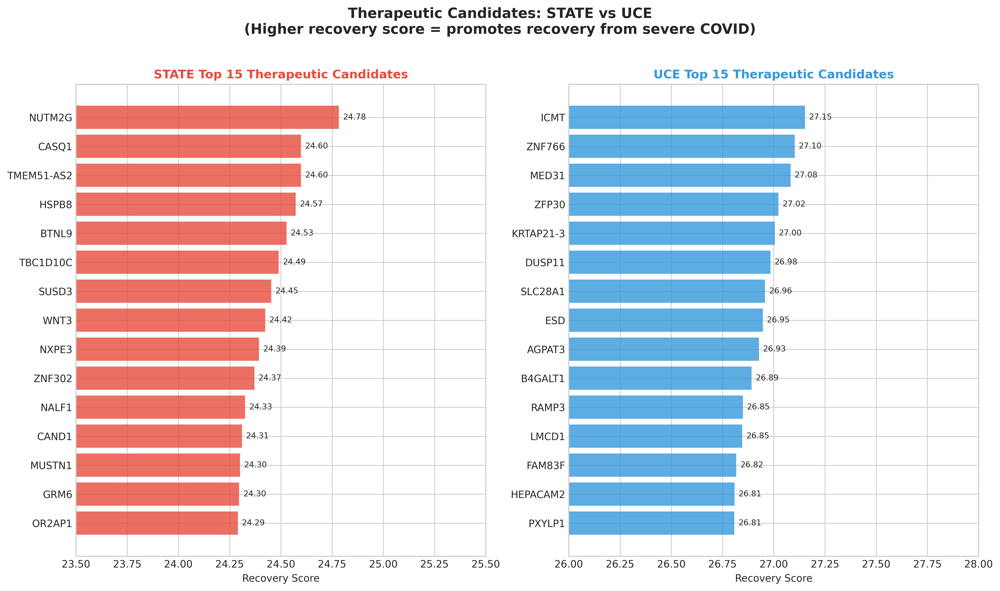
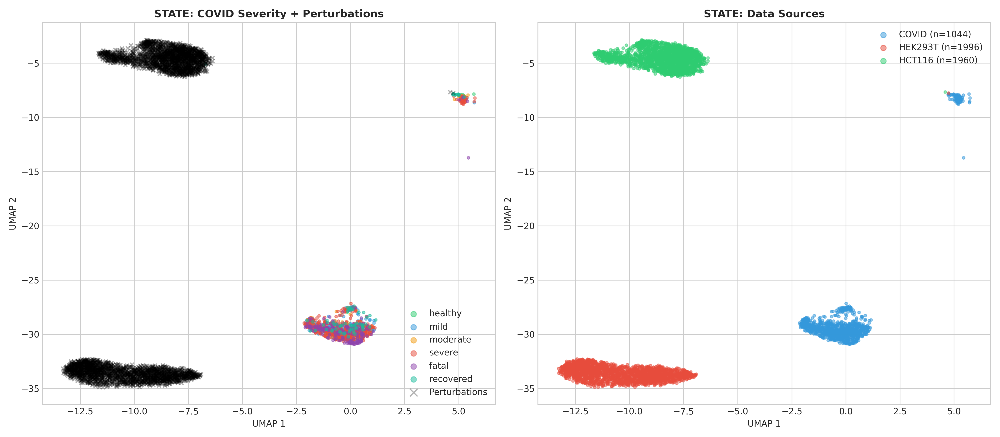
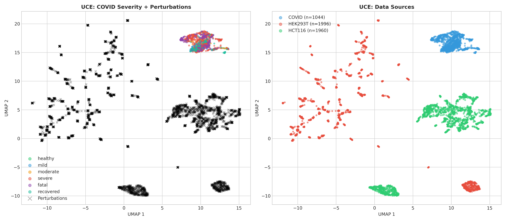
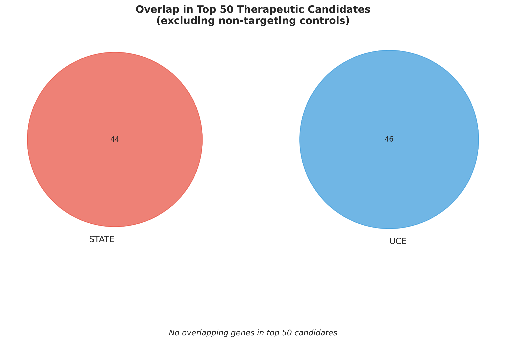

# 🩸 Platelet-FM-Benchmark

**Benchmarking Single-Cell Foundation Models on Platelet Transcriptomics for Infection Severity and Cardiovascular Risk Prediction**

<p align="center">
  <a href="#key-results">Results</a> •
  <a href="#foundation-models">Models</a> •
  <a href="#visualizations">Visualizations</a> •
  <a href="#-perturbation-analysis-for-drug-discovery">Drug Discovery</a> •
  <a href="#data">Data</a> •
  <a href="#usage">Usage</a>
</p>

---

## 📖 Background

This project is a **follow-up study** to our published work:

> **Qiu, X (2024). **Deciphering Abnormal Platelet Subpopulations in COVID-19, Sepsis and Systemic Lupus Erythematosus through Machine Learning and Single-Cell Transcriptomics.** *International Journal of Molecular Sciences*, 25(11), 5941.
>
> 📄 [Read the paper](https://www.mdpi.com/1422-0067/25/11/5941)

In our 2024 paper, we identified distinct platelet subpopulations associated with disease severity using traditional machine learning approaches. **This current project extends that work** by leveraging state-of-the-art **single-cell foundation models** to:
- Improve severity prediction accuracy
- Enable zero-shot transfer learning
- Discover novel therapeutic targets for cardiovascular complications

---

## 📌 Project Overview

Platelets play a critical role in both **infection response** and **cardiovascular complications**. This project benchmarks **five single-cell foundation models** on platelet transcriptomics to:

1. **Predict infection severity** (COVID-19, Sepsis)
2. **Identify cardiovascular risk biomarkers** post-infection
3. **Discover potential therapeutic targets** for cardiovascular treatment

### Key Question
> *Can foundation models pre-trained on millions of single cells capture disease-relevant patterns in platelets for infection severity and cardiovascular risk prediction?*

### Key Findings
> **1. Raw XGBoost (0.897 AUC) beats all foundation models!** Among foundation models, **STATE (Arc Institute) achieves 0.894 AUC**, outperforming UCE (0.876), TranscriptFormer (0.838), scGPT (0.833), and Geneformer (0.824). Three foundation models underperform simple PCA baselines.
>
> **2. STATE and UCE identify completely different therapeutic targets** when mapping ~178K perturbation cells to COVID severity states. No overlap in top 50 candidates suggests models capture different biological signals.

---

## 🏆 Key Results

### Full Ranking: Foundation Models vs Baselines

| Rank | Method | AUC | Type | Notes |
|:----:|--------|:---:|:----:|-------|
| 🥇 | **Raw_XGBoost** | **0.897** | Baseline | Best overall! |
| 🥈 | **STATE** | **0.894** | Foundation | Best foundation model |
| 🥉 | Raw_LogReg | 0.878 | Baseline | Very competitive |
| 4 | UCE | 0.876 | Foundation | Barely beats LogReg |
| 5 | Raw_RF | 0.867 | Baseline | |
| 6 | PCA_500 | 0.850 | Baseline | |
| 7 | TranscriptFormer | 0.838 | Foundation | Below PCA baselines |
| 8 | scGPT | 0.833 | Foundation | Below PCA baselines |
| 9 | Geneformer | 0.824 | Foundation | Below PCA baselines |

### Foundation Models: Multi-Task Performance

| Model | Binary AUC | 3-Class AUC | 6-Class AUC | Avg AUC |
|-------|:----------:|:-----------:|:-----------:|:-------:|
| **STATE** | **0.894** | **0.893** | **0.894** | **0.894** |
| UCE | 0.876 | 0.885 | 0.888 | 0.883 |
| TranscriptFormer | 0.838 | 0.851 | 0.849 | 0.846 |
| Geneformer | 0.824 | 0.833 | 0.821 | 0.826 |
| scGPT | 0.833 | 0.747 | 0.810 | 0.797 |

<p align="center">
  
</p>

<p align="center">
  
</p>

### Key Insights

- **Raw XGBoost beats all foundation models** (0.897 vs 0.894 for STATE)
- **Only STATE is competitive** with simple baselines among foundation models
- **3 of 5 foundation models underperform PCA baselines** (TranscriptFormer, scGPT, Geneformer)
- **STATE is remarkably consistent** across tasks (0.893-0.894 AUC)
- **UCE barely beats Raw_LogReg** (0.876 vs 0.878) - questions foundation model value

---

## 🔬 Foundation Models Compared

| Model | Publication | Training Scale | Architecture | Primary Focus |
|-------|-------------|----------------|--------------|---------------|
| [**STATE**](https://github.com/ArcInstitute/state) | bioRxiv 2025 | Large-scale | Transformer + ESM2 | Perturbation response |
| [**UCE**](https://github.com/snap-stanford/UCE) | bioRxiv 2023 | 36M cells | Transformer + ESM2 | Cross-species |
| [**scGPT**](https://github.com/bowang-lab/scGPT) | Nat Methods 2024 | 33M cells | GPT-style | Multi-omics |
| [**Geneformer**](https://huggingface.co/ctheodoris/Geneformer) | Nature 2023 | 30M cells | BERT-style | Network biology |
| [**TranscriptFormer**](https://virtualcellmodels.cziscience.com) | bioRxiv 2025 | 112M cells | Autoregressive | Generative |

📖 **Detailed comparison:** [docs/FOUNDATION_MODEL_COMPARISON.md](docs/FOUNDATION_MODEL_COMPARISON.md)

---

## 📊 Visualizations

### UMAP: 4 Models × 6 Severity Classes

<p align="center">
  
</p>

### UMAP: Binary Classification (Severe vs Non-Severe)

<p align="center">
  
</p>

### UCE: PCA, UMAP, t-SNE Comparison

<p align="center">
  
</p>

### UCE: Severity Gradient Visualization

<p align="center">
  
</p>

### Comprehensive: 4 Models × 3 Methods

<p align="center">
  
</p>

### Performance Heatmap

<p align="center">
  
</p>

---

## 💊 Perturbation Analysis for Drug Discovery

Using **STATE** and **UCE** embeddings, we mapped **~178,000 perturbation cells** (HEK293T + HCT116) to COVID severity states to identify potential therapeutic candidates.

### Approach
1. Compute severity centroids from COVID platelet embeddings
2. Define **recovery direction** (severe → recovered) and **disease direction** (healthy → severe)
3. Score each perturbation by projection onto recovery direction
4. Identify perturbations that shift transcriptional states toward recovery

### STATE vs UCE Comparison Dashboard

<p align="center">
  
</p>

### Top Therapeutic Candidates: STATE vs UCE

| Rank | STATE Gene | Score | UCE Gene | Score |
|:----:|------------|:-----:|----------|:-----:|
| 1 | **NUTM2G** | 24.78 | **ICMT** | 27.15 |
| 2 | **CASQ1** | 24.60 | **ZNF766** | 27.10 |
| 3 | **HSPB8** | 24.57 | **MED31** | 27.08 |
| 4 | **BTNL9** | 24.53 | **ZFP30** | 27.02 |
| 5 | **TBC1D10C** | 24.49 | **DUSP11** | 26.98 |
| 6 | **SUSD3** | 24.45 | **SLC28A1** | 26.96 |
| 7 | **WNT3** | 24.42 | **ESD** | 26.95 |
| 8 | **NXPE3** | 24.39 | **AGPAT3** | 26.93 |
| 9 | **ZNF302** | 24.37 | **B4GALT1** | 26.89 |
| 10 | **NALF1** | 24.33 | **RAMP3** | 26.85 |

### Top Candidates Comparison

<p align="center">
  
</p>

### Perturbation Landscapes

<p align="center">
  
  
</p>

### Key Findings

| Finding | Details |
|---------|---------|
| **No overlap in top 50** | STATE and UCE identify completely different therapeutic targets |
| **Different pathways** | STATE: calcium signaling, autophagy, Wnt; UCE: prenylation, glycosylation, lipid metabolism |
| **Score ranges** | UCE (26.8-27.2) vs STATE (24.3-24.8) |
| **Both target recovery** | All top candidates closest to "recovered" severity state |

### Candidate Overlap Analysis

<p align="center">
  
</p>

### Analysis Summary
- **Total perturbations analyzed:** 16,248 (per model)
- **Therapeutic candidates identified:** 50 per model (high recovery score, closest to recovered/healthy)
- **Data sources:** HEK293T (88,434 cells) + HCT116 (89,738 cells) from the [X-Atlas/Orion genome-wide Perturb-seq dataset](https://doi.org/10.1101/2025.06.11.659105) (Huang et al., bioRxiv 2025)

📄 **Detailed Report:** [results/perturbation_analysis/PERTURBATION_ANALYSIS_REPORT.md](results/perturbation_analysis/PERTURBATION_ANALYSIS_REPORT.md)

---

## 📁 Data

### Platelet Single-Cell Datasets

| Dataset | Disease | Cells | Description |
|---------|---------|------:|-------------|
| COVID-19 + Sepsis | Viral & Bacterial Infection | ~47,000 | Severity progression (healthy → fatal) |
| Perturbation | Drug Response | ~178,000 | HEK293T + HCT116 perturbation screens |

**Perturbation Data Source:** The perturbation data (HEK293T: 88,434 cells + HCT116: 89,738 cells) is from the [X-Atlas/Orion dataset](https://doi.org/10.1101/2025.06.11.659105) (Huang et al., bioRxiv 2025), a genome-wide Perturb-seq atlas targeting 18,903 human genes using the FiCS (Fix-Cryopreserve-ScRNAseq) platform.

### COVID-19 Severity Distribution

| Severity | Cells | Percentage | Binary Class |
|----------|------:|:----------:|:------------:|
| Healthy | 3,205 | 6.7% | Non-Severe |
| Mild | 7,359 | 15.3% | Non-Severe |
| Moderate | 4,330 | 9.0% | Non-Severe |
| Recovered | 3,695 | 7.7% | Non-Severe |
| Severe | 19,805 | 41.3% | **Severe** |
| Fatal | 9,414 | 19.6% | **Severe** |

---

## 🛠️ Methods

### Pipeline Overview

```
┌─────────────────────────────────────────────────────────────────┐
│  Raw scRNA-seq  →  QC/Preprocessing  →  Foundation Model        │
│                                              ↓                  │
│                                        Embeddings               │
│                                              ↓                  │
│                    StandardScaler  →  Classifier  →  5-Fold CV  │
│                                              ↓                  │
│                                     Severity Prediction         │
└─────────────────────────────────────────────────────────────────┘
```

### Embedding Generation
- Pre-trained foundation models (no fine-tuning)
- Zero-shot evaluation
- Cell-level embeddings extracted

### Classification
- **Classifiers:** Logistic Regression, Random Forest
- **Validation:** 5-fold stratified cross-validation
- **Metrics:** AUC, Balanced Accuracy, F1-score

---

## 💻 Usage

### Installation

```bash
git clone https://github.com/xqiu625/Platelet-FM-Benchmark.git
cd Platelet-FM-Benchmark
pip install -r requirements.txt
```

### Run Benchmark

```bash
# Single model (quick mode: LogReg + RandomForest only)
python scripts/analysis/benchmark_single_model.py --model UCE --quick --tasks binary

# All 5 models
for model in STATE UCE scGPT Geneformer TranscriptFormer; do
    python scripts/analysis/benchmark_single_model.py --model $model --quick --tasks binary
done

# Merge results
python scripts/analysis/merge_benchmark_results.py
```

### Generate Figures

```bash
# Benchmark figures (bar charts, heatmaps)
python scripts/analysis/create_benchmark_figures.py

# Embedding visualizations (UMAP, PCA, t-SNE)
python scripts/analysis/create_embedding_visualizations.py
```

### Options

| Flag | Description |
|------|-------------|
| `--model` | STATE, UCE, scGPT, Geneformer, TranscriptFormer |
| `--tasks` | binary, 3-class, 6-class |
| `--quick` | Fast mode (LogReg + RF only) |
| `--cv-folds` | Number of CV folds (default: 5) |

---

## 📂 Repository Structure

```
Platelet-FM-Benchmark/
├── README.md                           # This file
├── requirements.txt                    # Dependencies
├── figures/                            # Generated visualizations (PNG + PDF)
│   ├── fig1_model_comparison.png/pdf   # Main benchmark results
│   ├── fig2_heatmap.png/pdf            # Performance heatmap
│   ├── fig3_auc_comparison.png/pdf     # AUC comparison
│   ├── umap_4models_6class.png/pdf     # UMAP comparisons
│   ├── uce_perturbation_landscape.png/pdf  # Perturbation UMAP
│   ├── uce_therapeutic_rankings.png/pdf    # Drug target rankings
│   └── ...
├── scripts/
│   └── analysis/
│       ├── benchmark_single_model.py   # Run single model benchmark
│       ├── merge_benchmark_results.py  # Combine all results
│       ├── create_benchmark_figures.py # Generate result figures
│       └── create_embedding_visualizations.py  # UMAP/PCA/t-SNE
├── docs/
│   └── FOUNDATION_MODEL_COMPARISON.md  # Detailed model comparison
└── results/
    └── perturbation_analysis/          # Drug discovery outputs
        ├── uce_therapeutic_candidates_*.csv   # Top 50 drug targets
        ├── uce_perturbation_scores_*.csv      # All 16,248 perturbation scores
        └── uce_analysis_report_*.txt          # Summary report
```


## 📚 References

### Prior Work (2024 Paper)
```bibtex
@article{qiu2024deciphering,
  title={Deciphering Abnormal Platelet Subpopulations in COVID-19, Sepsis and Systemic Lupus Erythematosus through Machine Learning and Single-Cell Transcriptomics},
  author={Qiu, Xinru and M{\"u}ller-Tidow, Carsten and Zang, Chongzhi},
  journal={International Journal of Molecular Sciences},
  volume={25},
  number={11},
  pages={5941},
  year={2024},
  publisher={MDPI},
  doi={10.3390/ijms25115941}
}
```

### This Work
```bibtex
@misc{qiu2025platelet_fm,
  title={Platelet-FM-Benchmark: Benchmarking Single-Cell Foundation Models on Platelet Transcriptomics},
  author={Qiu, Xinru},
  year={2025},
  url={https://github.com/xqiu625/Platelet-FM-Benchmark}
}
```

### Foundation Models
1. **STATE:** Arc Institute (2025). State: Perturbation Response Prediction. *bioRxiv*. [GitHub](https://github.com/ArcInstitute/state)
2. **UCE:** Rosen et al. (2023). Universal Cell Embeddings. *bioRxiv*. [Paper](https://doi.org/10.1101/2023.11.28.568918)
3. **scGPT:** Cui et al. (2024). scGPT: Foundation Model for Single-cell Multi-omics. *Nature Methods*. [Paper](https://www.nature.com/articles/s41592-024-02201-0)
4. **Geneformer:** Theodoris et al. (2023). Transfer learning for network biology. *Nature*. [Paper](https://doi.org/10.1038/s41586-023-06139-9)
5. **TranscriptFormer:** Pearce et al. (2025). Cross-Species Generative Cell Atlas. *bioRxiv*. [Paper](https://doi.org/10.1101/2025.04.25.650731)

### Perturbation Dataset
6. **X-Atlas/Orion:** Huang et al. (2025). Genome-wide Perturb-seq Datasets via a Scalable Fix-Cryopreserve Platform for Training Dose-Dependent Biological Foundation Models. *bioRxiv*. [Paper](https://doi.org/10.1101/2025.06.11.659105)

---

## 👤 Author

**Xinru Qiu**
📧 xinru.reina.qiu@gmail.com
🐙 [@xqiu625](https://github.com/xqiu625)

---

## 📄 License

This project is licensed under the MIT License - see [LICENSE](LICENSE) file for details.

---

<p align="center">
  <b>⭐ If you find this benchmark useful, please consider starring the repo!</b>
</p>
