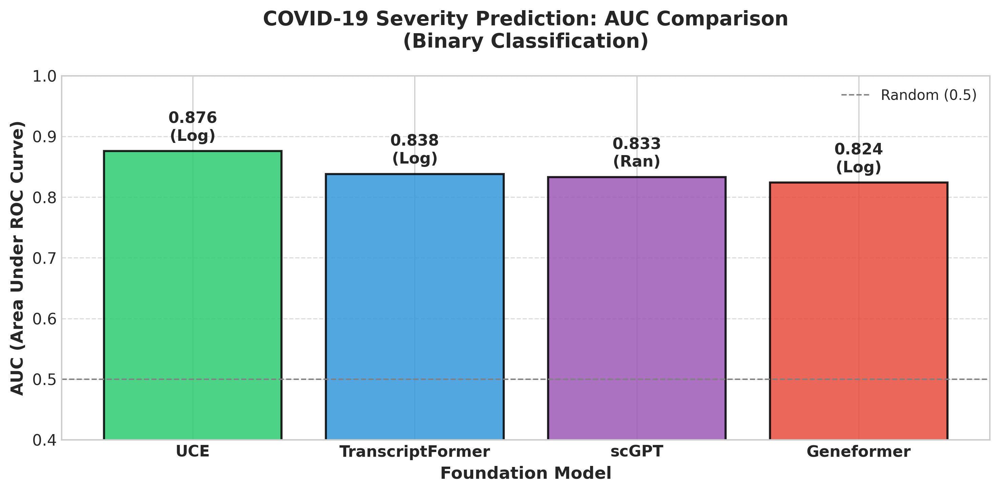
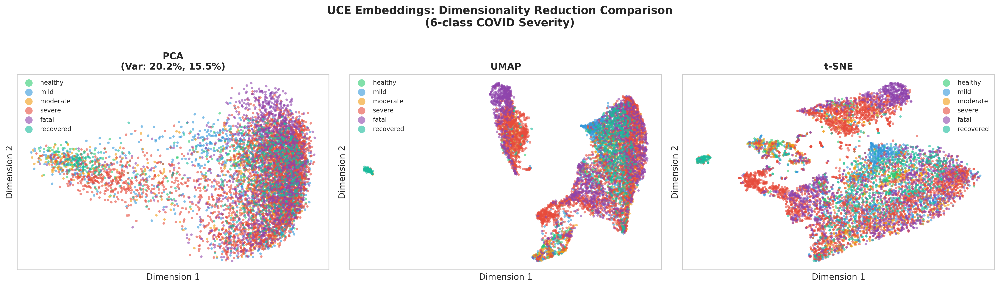
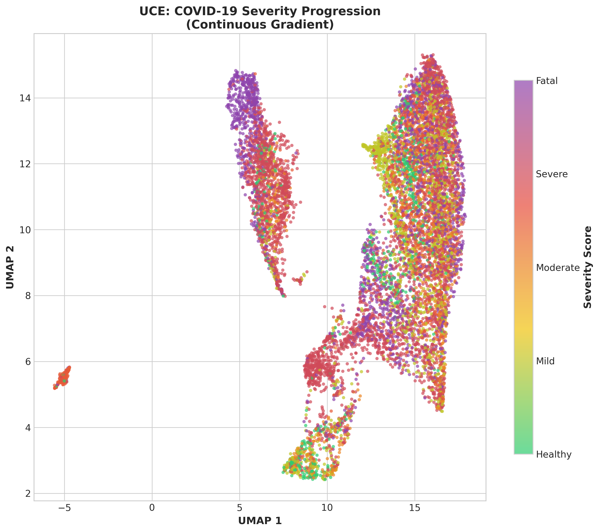
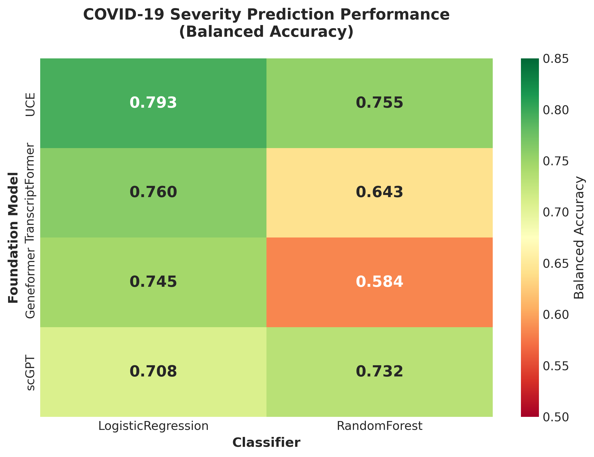

# 🩸 Platelet-FM-Benchmark

**Benchmarking Single-Cell Foundation Models on Platelet Transcriptomics for Infection Severity and Cardiovascular Risk Prediction**

<p align="center">
  
</p>

<p align="center">
  <a href="#key-results">Results</a> •
  <a href="#foundation-models">Models</a> •
  <a href="#visualizations">Visualizations</a> •
  <a href="#data">Data</a> •
  <a href="#usage">Usage</a> •
  <a href="#roadmap">Roadmap</a>
</p>

---

## 📖 Background

This project is a **follow-up study** to our published work:

> **Qiu, X.**, Müller-Tidow, C., & Zang, C. (2024). **Deciphering Abnormal Platelet Subpopulations in COVID-19, Sepsis and Systemic Lupus Erythematosus through Machine Learning and Single-Cell Transcriptomics.** *International Journal of Molecular Sciences*, 25(11), 5941.
>
> 📄 [Read the paper](https://www.mdpi.com/1422-0067/25/11/5941)

In our 2024 paper, we identified distinct platelet subpopulations associated with disease severity using traditional machine learning approaches. **This current project extends that work** by leveraging state-of-the-art **single-cell foundation models** to:
- Improve severity prediction accuracy
- Enable zero-shot transfer learning
- Discover novel therapeutic targets for cardiovascular complications

---

## 📌 Project Overview

Platelets play a critical role in both **infection response** and **cardiovascular complications**. This project benchmarks **four single-cell foundation models** on platelet transcriptomics to:

1. **Predict infection severity** (COVID-19, Sepsis)
2. **Identify cardiovascular risk biomarkers** post-infection
3. **Discover potential therapeutic targets** for cardiovascular treatment

### Key Question
> *Can foundation models pre-trained on millions of single cells capture disease-relevant patterns in platelets for infection severity and cardiovascular risk prediction?*

### Key Finding
> **UCE (Universal Cell Embeddings) achieves 0.876 AUC** for severity classification, outperforming scGPT, Geneformer, and TranscriptFormer on platelet transcriptomics.

---

## 🏆 Key Results

### Binary Classification: Severe vs Non-Severe

| Rank | Model | AUC | Balanced Accuracy | Embedding Dims |
|:----:|-------|:---:|:-----------------:|:--------------:|
| 🥇 | **UCE** | **0.876** | **0.793** | 1,280 |
| 🥈 | TranscriptFormer | 0.838 | 0.760 | 2,048 |
| 🥉 | Geneformer | 0.824 | 0.745 | 1,152 |
| 4 | scGPT | 0.833 | 0.732 | 512 |

<p align="center">
  
</p>

<p align="center">
  
</p>

### Key Insights

- **UCE achieves best performance** (AUC 0.876) with simple logistic regression
- **Logistic regression outperforms random forest** for 3/4 models → embeddings have good linear separability
- **All foundation models achieve AUC > 0.7** → pre-training transfers well to clinical prediction

---

## 🔬 Foundation Models Compared

| Model | Publication | Training Scale | Architecture | Primary Focus |
|-------|-------------|----------------|--------------|---------------|
| [**UCE**](https://github.com/snap-stanford/UCE) | bioRxiv 2023 | 36M cells | Transformer + ESM2 | Cross-species |
| [**scGPT**](https://github.com/bowang-lab/scGPT) | Nat Methods 2024 | 33M cells | GPT-style | Multi-omics |
| [**Geneformer**](https://huggingface.co/ctheodoris/Geneformer) | Nature 2023 | 30M cells | BERT-style | Network biology |
| [**TranscriptFormer**](https://virtualcellmodels.cziscience.com) | bioRxiv 2025 | 112M cells | Autoregressive | Generative |

📖 **Detailed comparison:** [docs/FOUNDATION_MODEL_COMPARISON.md](docs/FOUNDATION_MODEL_COMPARISON.md)

---

## 📊 Visualizations

### UMAP: 4 Models × 6 Severity Classes

<p align="center">
  
</p>

### UMAP: Binary Classification (Severe vs Non-Severe)

<p align="center">
  
</p>

### UCE: PCA, UMAP, t-SNE Comparison

<p align="center">
  
</p>

### UCE: Severity Gradient Visualization

<p align="center">
  
</p>

### Comprehensive: 4 Models × 3 Methods

<p align="center">
  
</p>

### Performance Heatmap

<p align="center">
  
</p>

---

## 📁 Data

### Platelet Single-Cell Datasets

| Dataset | Disease | Cells | Description |
|---------|---------|------:|-------------|
| COVID-19 | Viral Infection | ~47,000 | Severity progression (healthy → fatal) |
| Sepsis | Bacterial Infection | *Coming soon* | Sepsis severity prediction |
| Perturbation | Drug Response | ~100,000 | HEK293T + HCT116 perturbation screens |

### COVID-19 Severity Distribution

| Severity | Cells | Percentage | Binary Class |
|----------|------:|:----------:|:------------:|
| Healthy | 3,205 | 6.7% | Non-Severe |
| Mild | 7,359 | 15.3% | Non-Severe |
| Moderate | 4,330 | 9.0% | Non-Severe |
| Recovered | 3,695 | 7.7% | Non-Severe |
| Severe | 19,805 | 41.3% | **Severe** |
| Fatal | 9,414 | 19.6% | **Severe** |

---

## 🛠️ Methods

### Pipeline Overview

```
┌─────────────────────────────────────────────────────────────────┐
│  Raw scRNA-seq  →  QC/Preprocessing  →  Foundation Model        │
│                                              ↓                  │
│                                        Embeddings               │
│                                              ↓                  │
│                    StandardScaler  →  Classifier  →  5-Fold CV  │
│                                              ↓                  │
│                                     Severity Prediction         │
└─────────────────────────────────────────────────────────────────┘
```

### Embedding Generation
- Pre-trained foundation models (no fine-tuning)
- Zero-shot evaluation
- Cell-level embeddings extracted

### Classification
- **Classifiers:** Logistic Regression, Random Forest
- **Validation:** 5-fold stratified cross-validation
- **Metrics:** AUC, Balanced Accuracy, F1-score

---

## 💻 Usage

### Installation

```bash
git clone https://github.com/xqiu625/Platelet-FM-Benchmark.git
cd Platelet-FM-Benchmark
pip install -r requirements.txt
```

### Run Benchmark

```bash
# Single model (quick mode: LogReg + RandomForest only)
python scripts/analysis/benchmark_single_model.py --model UCE --quick --tasks binary

# All 4 models
for model in UCE scGPT Geneformer TranscriptFormer; do
    python scripts/analysis/benchmark_single_model.py --model $model --quick --tasks binary
done

# Merge results
python scripts/analysis/merge_benchmark_results.py
```

### Generate Figures

```bash
# Benchmark figures (bar charts, heatmaps)
python scripts/analysis/create_benchmark_figures.py

# Embedding visualizations (UMAP, PCA, t-SNE)
python scripts/analysis/create_embedding_visualizations.py
```

### Options

| Flag | Description |
|------|-------------|
| `--model` | UCE, scGPT, Geneformer, TranscriptFormer |
| `--tasks` | binary, 3-class, 6-class |
| `--quick` | Fast mode (LogReg + RF only) |
| `--cv-folds` | Number of CV folds (default: 5) |

---

## 📂 Repository Structure

```
Platelet-FM-Benchmark/
├── README.md                           # This file
├── requirements.txt                    # Dependencies
├── figures/                            # Generated visualizations
│   ├── fig1_model_comparison.png       # Main benchmark results
│   ├── umap_4models_6class.png         # UMAP comparisons
│   ├── uce_severity_gradient.png       # Severity progression
│   └── ...
├── scripts/
│   └── analysis/
│       ├── benchmark_single_model.py   # Run single model benchmark
│       ├── merge_benchmark_results.py  # Combine all results
│       ├── create_benchmark_figures.py # Generate result figures
│       └── create_embedding_visualizations.py  # UMAP/PCA/t-SNE
├── docs/
│   └── FOUNDATION_MODEL_COMPARISON.md  # Detailed model comparison
└── results/                            # Benchmark outputs (CSV, JSON)
```

---

## 📈 Roadmap

### Completed ✅
- [x] Generate embeddings for 4 foundation models
- [x] Binary classification benchmark (severe vs non-severe)
- [x] UMAP/PCA/t-SNE visualizations
- [x] Model comparison documentation

### In Progress 🔄
- [ ] 3-class classification (control/mild/severe)
- [ ] 6-class classification (all severity levels)
- [ ] Sepsis dataset integration

### Planned 📋
- [ ] Perturbation analysis for drug discovery
- [ ] STATE model integration for drug response prediction
- [ ] Cardiovascular biomarker identification
- [ ] Cross-disease transfer learning (COVID → Sepsis)
- [ ] Interactive HuggingFace demo

---

## 📚 References

### Prior Work (2024 Paper)
```bibtex
@article{qiu2024deciphering,
  title={Deciphering Abnormal Platelet Subpopulations in COVID-19, Sepsis and Systemic Lupus Erythematosus through Machine Learning and Single-Cell Transcriptomics},
  author={Qiu, Xinru and M{\"u}ller-Tidow, Carsten and Zang, Chongzhi},
  journal={International Journal of Molecular Sciences},
  volume={25},
  number={11},
  pages={5941},
  year={2024},
  publisher={MDPI},
  doi={10.3390/ijms25115941}
}
```

### This Work
```bibtex
@misc{qiu2025platelet_fm,
  title={Platelet-FM-Benchmark: Benchmarking Single-Cell Foundation Models on Platelet Transcriptomics},
  author={Qiu, Xinru},
  year={2025},
  url={https://github.com/xqiu625/Platelet-FM-Benchmark}
}
```

### Foundation Models
1. **UCE:** Rosen et al. (2023). Universal Cell Embeddings. *bioRxiv*. [Paper](https://doi.org/10.1101/2023.11.28.568918)
2. **scGPT:** Cui et al. (2024). scGPT: Foundation Model for Single-cell Multi-omics. *Nature Methods*. [Paper](https://www.nature.com/articles/s41592-024-02201-0)
3. **Geneformer:** Theodoris et al. (2023). Transfer learning for network biology. *Nature*. [Paper](https://doi.org/10.1038/s41586-023-06139-9)
4. **TranscriptFormer:** Pearce et al. (2025). Cross-Species Generative Cell Atlas. *bioRxiv*. [Paper](https://doi.org/10.1101/2025.04.25.650731)

---

## 👤 Author

**Xinru Qiu**
UC San Diego | Godzik Lab
📧 xqiu@ucsd.edu
🐙 [@xqiu625](https://github.com/xqiu625)

---

## 📄 License

This project is licensed under the MIT License - see [LICENSE](LICENSE) file for details.

---

<p align="center">
  <b>⭐ If you find this benchmark useful, please consider starring the repo!</b>
</p>
