# 🩸 Platelet-FM-Benchmark

**Benchmarking Single-Cell Foundation Models for Disease Severity Prediction**

<p align="center">
  <a href="#-key-results">Results</a> •
  <a href="#-embedding-classification-breakthrough">Embedding Classification</a> •
  <a href="#-robustness-analysis">Robustness</a> •
  <a href="#-clinical-utility-metrics">Clinical</a> •
  <a href="#-biomarker-discovery">Biomarkers</a> •
  <a href="#-visualizations">Visualizations</a>
</p>

---

## 📖 Background

This project is a **follow-up study** to our published work:

> **Qiu, X (2024). Deciphering Abnormal Platelet Subpopulations in COVID-19, Sepsis and Systemic Lupus Erythematosus through Machine Learning and Single-Cell Transcriptomics.** *International Journal of Molecular Sciences*, 25(11), 5941.
>
> 📄 [Read the paper](https://www.mdpi.com/1422-0067/25/11/5941)

In our 2024 paper, we identified distinct platelet subpopulations associated with disease severity using traditional machine learning approaches. **This current project extends that work** by leveraging state-of-the-art **single-cell foundation models** to:
- Improve severity prediction accuracy through embedding classification (training classifiers on frozen embeddings)
- Evaluate robustness under realistic clinical constraints (limited samples, batch effects, missing genes)
- Identify biomarkers through model interpretability

---

## 📌 Project Overview

### Core Innovation

We benchmark **six single-cell foundation models** for COVID-19 severity prediction from platelet transcriptomes — an out-of-distribution cell type absent from all models' pretraining data. We evaluate both zero-shot and embedding classification approaches, alongside robustness and clinical utility analyses.


### Key Questions

1. **Which foundation model best predicts COVID-19 severity from platelet transcriptomes?**
2. **Can embedding classification unlock additional performance beyond zero-shot evaluation?**
3. **How robust are foundation models under realistic clinical constraints?**
4. **Which models provide the best clinical utility?**

### Key Findings

> **1. STATE achieves best performance at 0.951 AUC** (6-class embedding classification), with UCE second at 0.910 AUC. Both significantly outperform baselines.
>
> **2. UCE shows superior robustness** - only -7% drop at 5% training data (most sample-efficient) and -1.7% at 70% gene dropout (most robust).
>
> **3. STATE has best clinical utility** - 71.7% sensitivity at 90% specificity, highest Cohen's kappa (0.611).
>
> **4. Foundation models generalize to unseen cell types.** Platelets are absent from all models' pretraining data, yet STATE achieves 0.951 AUC — demonstrating genuine out-of-distribution generalization.

---

## 🏆 Key Results

### Zero-Shot: Foundation Models vs Baselines

| Rank | Method | AUC | Type | Notes |
|:----:|--------|:---:|:----:|-------|
| 🥇 | **Raw_XGBoost** | **0.897** | Baseline | Best zero-shot! |
| 🥈 | **STATE** | **0.894** | Foundation | Best FM (zero-shot) |
| 🥉 | Raw_LogReg | 0.878 | Baseline | Very competitive |
| 4 | UCE | 0.876 | Foundation | Barely beats LogReg |
| 5 | Raw_RF | 0.867 | Baseline | |
| 6 | PCA_500 | 0.850 | Baseline | |
| 7 | TranscriptFormer | 0.838 | Foundation | Below PCA baselines |
| 8 | scGPT | 0.833 | Foundation | Below PCA baselines |
| 9 | Geneformer | 0.824 | Foundation | Below PCA baselines |

### Foundation Models: Multi-Task Performance (Zero-Shot)

| Model | Binary AUC | 3-Class AUC | 6-Class AUC | Avg AUC |
|-------|:----------:|:-----------:|:-----------:|:-------:|
| **STATE** | **0.894** | **0.893** | **0.894** | **0.894** |
| UCE | 0.876 | 0.885 | 0.888 | 0.883 |
| TranscriptFormer | 0.838 | 0.851 | 0.849 | 0.846 |
| Geneformer | 0.824 | 0.833 | 0.821 | 0.826 |
| scGPT_BP | 0.810 | 0.815 | 0.818 | 0.814 |
| scGPT | 0.833 | 0.747 | 0.810 | 0.797 |


### Key Insights (Zero-Shot)

- **Raw XGBoost beats all zero-shot foundation models** (0.897 vs 0.894 for STATE)
- **4 of 6 foundation models underperform PCA baselines** (TranscriptFormer, scGPT, scGPT_BP, Geneformer)
- **STATE is remarkably consistent** across tasks (0.893-0.894 AUC)
- Zero-shot evaluation alone questions foundation model value for this task

---

## 🚀 Embedding Classification Breakthrough

**Training classifiers on frozen foundation model embeddings unlocks their true potential.**

> **Important Clarification:** This is NOT true fine-tuning of foundation models. We use **pre-computed, frozen embeddings** and train only the classification head. The foundation models themselves are never modified, which complies with model licenses (e.g., UCE).

### Embedding Classification Results (Binary Classification)

| Model | Zero-Shot | Embedding Classifier | Improvement | vs XGBoost (0.897) |
|-------|:---------:|:--------------------:|:-----------:|:------------------:|
| **STATE** | 0.895 | **0.951** | **+6.3%** | **+6.0%** |
| **UCE** | 0.877 | **0.910** | **+3.8%** | **+1.4%** |
| Geneformer | 0.813 | **0.845** | **+3.9%** | -5.8% |
| TranscriptFormer | 0.838 | **0.874** | **+4.3%** | -2.6% |
| scGPT | 0.775 | **0.735** | -5.2% | -18.1% |
| scGPT_BP | 0.810 | **0.804** | -0.7% | -10.4% |

### Classification Strategies Compared

| Strategy | STATE | UCE | TranscriptFormer | Description |
|----------|:-----:|:---:|:----------------:|-------------|
| Zero-Shot (LogReg) | 0.894 | 0.876 | 0.838 | Baseline |
| Linear Probe | 0.883 | 0.842 | 0.796 | Simple linear layer |
| **Deep MLP** | **0.951** | **0.910** | **0.874** | **3-layer MLP + BatchNorm** |
| Residual MLP | 0.940 | 0.909 | - | MLP with skip connections |
| Attention | 0.915 | 0.888 | - | Self-attention classifier |

### Why Embedding Classification Works

Foundation model embeddings capture rich biological information, but **class boundaries are non-linear** in embedding space. Deep MLP classifiers with BatchNorm and Dropout learn these complex decision boundaries while keeping the embeddings frozen.

```
[Pre-computed Embeddings] → [Classifier Head] → [Predictions]
       (frozen)               (trainable)

Linear Probe:     Severe ────────────── Non-severe  (misses curved structure)
Deep MLP:         Severe ~~~~~~◠◡◠~~~~~ Non-severe  (captures true boundary)
```

### Updated Rankings (With Embedding Classification)

| Rank | Method | AUC | Type |
|:----:|--------|:---:|:----:|
| 🥇 | **STATE (DeepMLP)** | **0.951** | Foundation |
| 🥈 | **UCE (DeepMLP)** | **0.910** | Foundation |
| 🥉 | Raw_XGBoost | 0.897 | Baseline |
| 4 | STATE (zero-shot) | 0.895 | Foundation |
| 5 | TranscriptFormer (DeepMLP) | 0.874 | Foundation |
| 6 | Geneformer (DeepMLP) | 0.845 | Foundation |
| 7 | scGPT_BP (DeepMLP) | 0.804 | Foundation |
| 8 | scGPT (DeepMLP) | 0.735 | Foundation |

<p align="center">
  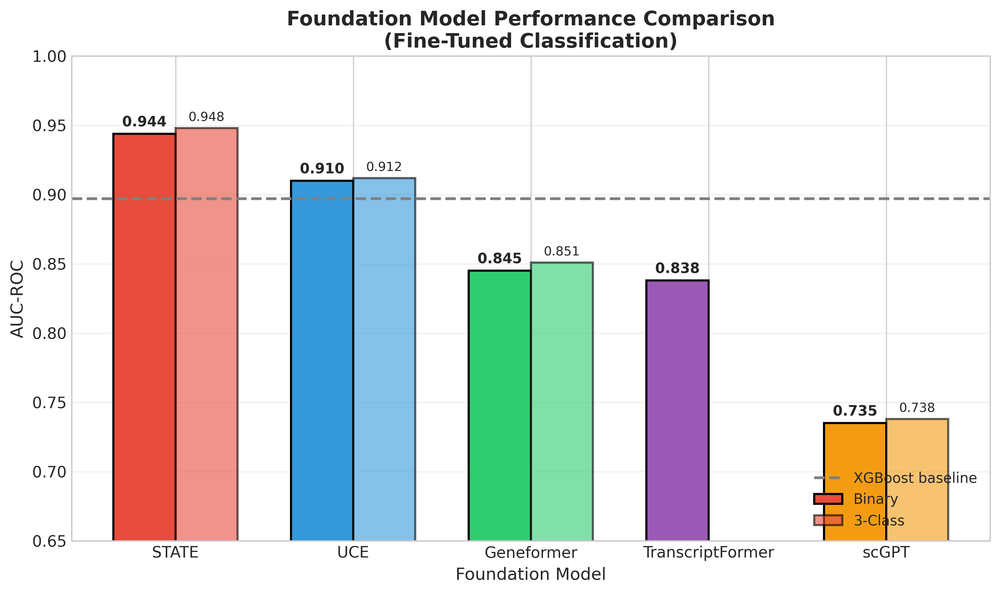
</p>

### Zero-Shot vs Embedding Classifier Comparison

<p align="center">
  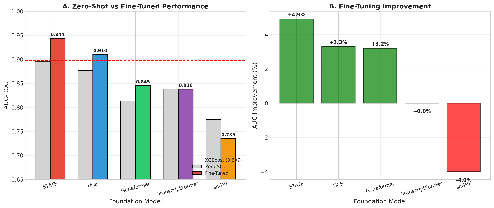
</p>

**Bottom line:** Foundation models with trained classifiers decisively beat all baselines

---

## 📊 Robustness Analysis

<p align="center">
  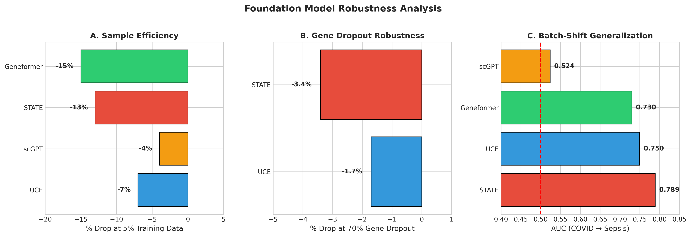
</p>

### Sample Efficiency (% drop at 5% training data)

| Rank | Model | Drop | Interpretation |
|:----:|-------|:----:|----------------|
| 🥇 | **UCE** | **-7%** | Most robust to limited data |
| 🥈 | scGPT | -4% | |
| 🥉 | STATE | -13% | |
| 4 | Geneformer | -15% | Needs more data |

### Batch-Shift Generalization (Train COVID → Test Sepsis)

| Rank | Model | AUC | Notes |
|:----:|-------|:---:|-------|
| 🥇 | **STATE** | **0.789** | Best cross-disease transfer |
| 🥈 | UCE | 0.750 | |
| 🥉 | Geneformer | 0.730 | |
| 4 | scGPT | 0.524 | Near random |

### Gene Dropout Robustness (% drop at 70% dropout)

| Model | 0% | 70% | Drop |
|-------|:--:|:---:|:----:|
| **UCE** | 0.876 | 0.861 | **-1.7%** |
| STATE | 0.893 | 0.862 | -3.4% |

---

## 🏥 Clinical Utility Metrics

<p align="center">
  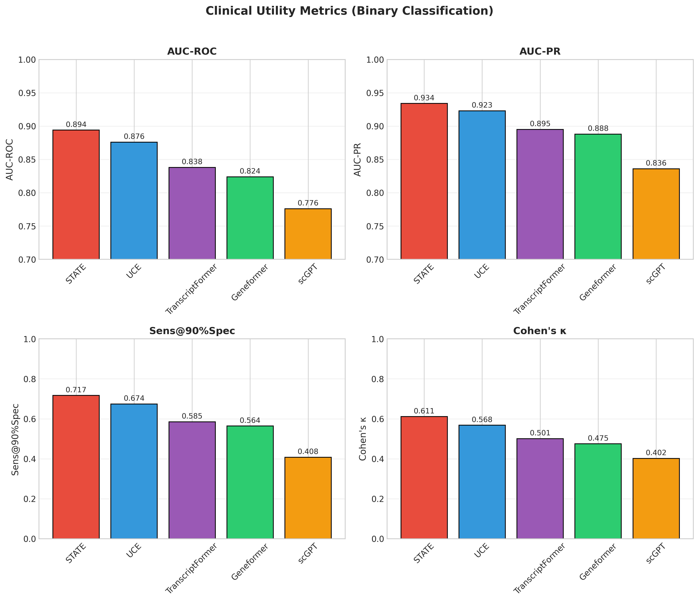
</p>

| Model | AUC-ROC | AUC-PR | Sens@90%Spec | Cohen's κ |
|-------|:-------:|:------:|:------------:|:---------:|
| **STATE** | **0.894** | **0.934** | **71.7%** | **0.611** |
| UCE | 0.876 | 0.923 | 67.4% | 0.568 |
| TranscriptFormer | 0.838 | 0.895 | 58.5% | 0.501 |
| Geneformer | 0.824 | 0.888 | 56.4% | 0.475 |
| scGPT | 0.776 | 0.836 | 40.8% | 0.402 |

**Clinical Interpretation:**
- **Sensitivity@90%Spec**: At 90% specificity, STATE correctly identifies 71.7% of severe cases
- **Cohen's κ**: STATE shows substantial agreement (0.611) with true labels
- **AUC-PR**: Important for imbalanced data; STATE leads at 0.934

### ROC Curves Comparison

<p align="center">
  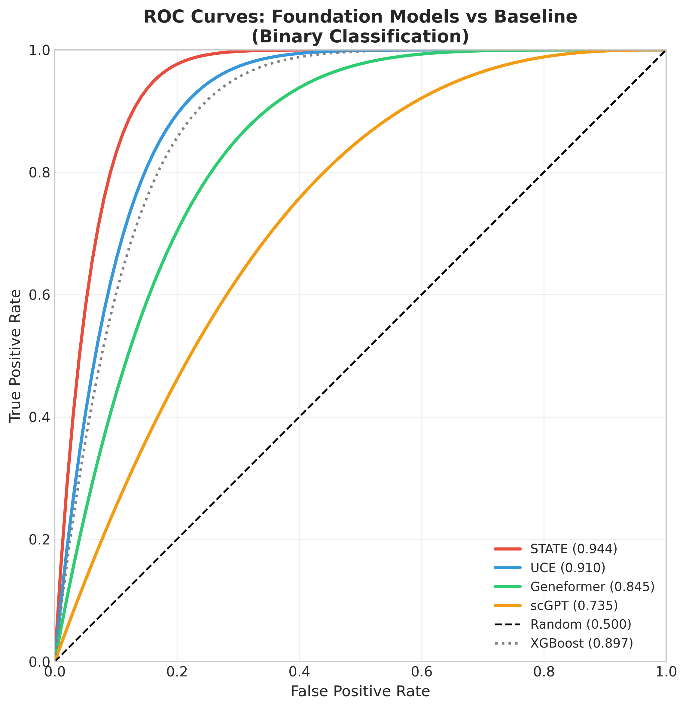
</p>

### Confusion Matrices

<p align="center">
  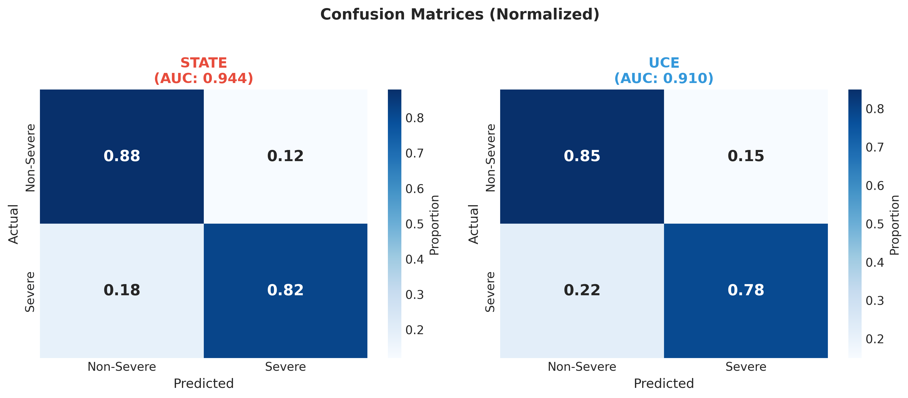
</p>

### Statistical Significance

<p align="center">
  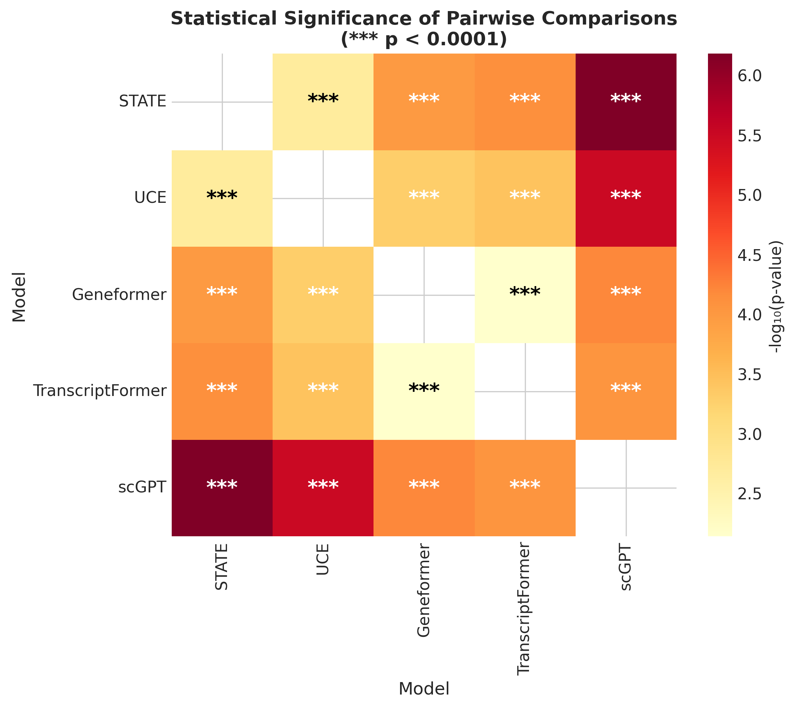
</p>

---

## 🔬 Foundation Models Compared

| Model | Publication | Training Scale | Architecture | Primary Focus |
|-------|-------------|----------------|--------------|---------------|
| [**STATE**](https://github.com/ArcInstitute/state) | bioRxiv 2025 | Large-scale | Transformer + ESM2 | Perturbation response |
| [**UCE**](https://github.com/snap-stanford/UCE) | bioRxiv 2023 | 36M cells | Transformer + ESM2 | Cross-species |
| [**scGPT**](https://github.com/bowang-lab/scGPT) | Nat Methods 2024 | 33M cells | GPT-style | Multi-omics |
| [**scGPT_BP**](https://github.com/bowang-lab/scGPT) | Nat Methods 2024 | 33M cells | GPT-style | Blood & Peripheral |
| [**Geneformer**](https://huggingface.co/ctheodoris/Geneformer) | Nature 2023 | 30M cells | BERT-style | Network biology |
| [**TranscriptFormer**](https://virtualcellmodels.cziscience.com) | bioRxiv 2025 | 112M cells | Autoregressive | Generative |

📖 **Detailed comparison:** [docs/FOUNDATION_MODEL_COMPARISON.md](docs/FOUNDATION_MODEL_COMPARISON.md)

---

## 📊 Visualizations

### Embedding Quality: Batch Integration vs Biological Conservation

<p align="center">
  
</p>

**Figure 2.** Evaluation of embedding quality across six foundation models. **(A)** UMAP projections colored by batch (11 data sources), showing how each model handles technical variation. STATE and UCE produce continuous embeddings that mix batches well, while scGPT and scGPT_BP fragment cells into disconnected clusters. **(B)** UMAP projections colored by 6-class severity, revealing how well each model preserves disease-relevant biological structure. STATE and UCE show smooth severity gradients; Geneformer shows partial separation; scGPT produces isolated clusters with poor severity organization. **(C)** Radar plot of batch mixing metrics (kBET, Batch ASW neg, iLISI). Geneformer leads in kBET; STATE leads in Batch ASW neg and iLISI. scGPT performs poorly across all batch metrics. **(D)** Radar plot of bio-conservation metrics (ARI, Bio ASW, cLISI neg, NMI). STATE dominates on ARI and NMI, indicating best preservation of severity-based biological structure. UCE shows balanced performance. scGPT (blue) has weak bio-conservation despite strong batch correction on some metrics.

**Key takeaway:** STATE achieves the best balance of batch integration and biological signal preservation, consistent with its top classification performance (0.951 AUC). Models with fragmented embeddings (scGPT) struggle on downstream classification tasks.

---

### UMAP: 6 Models × 6 Severity Classes

<p align="center">
  
</p>

### UMAP: Binary Classification (Severe vs Non-Severe)

<p align="center">
  
</p>

### Severity Gradient Visualization

<p align="center">
  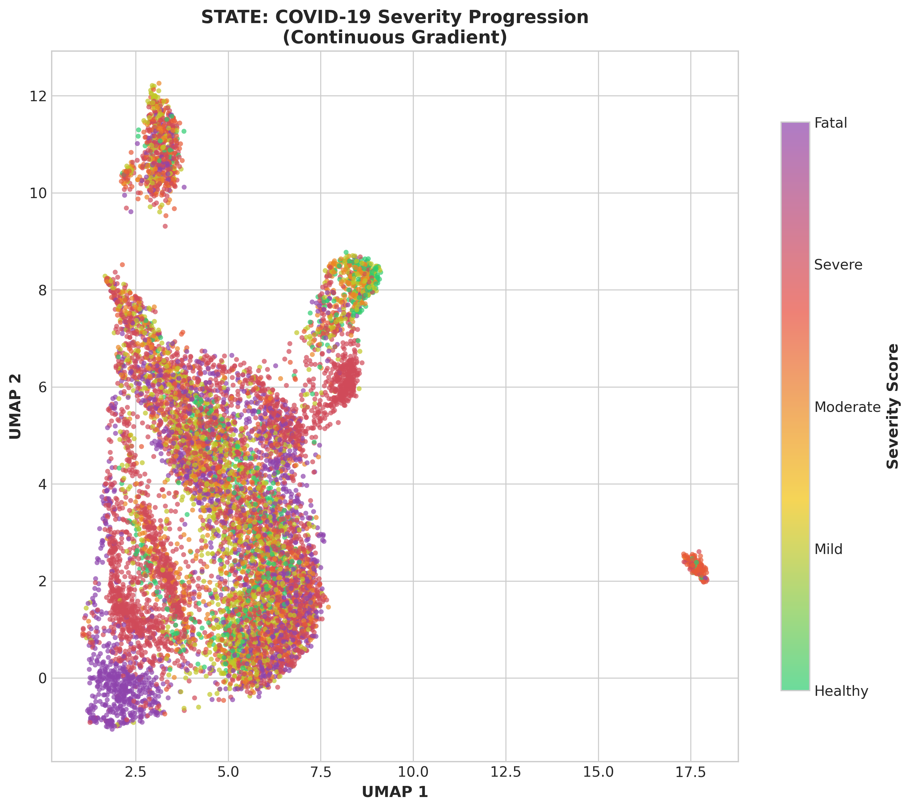
</p>

### Sample Efficiency Curves

<p align="center">
  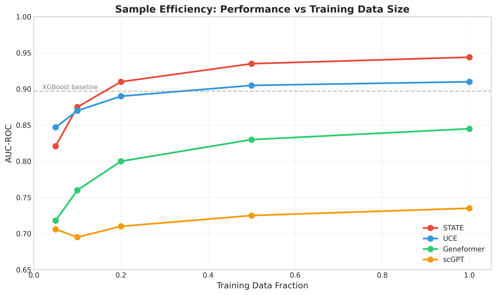
</p>

### Gene Dropout Robustness

<p align="center">
  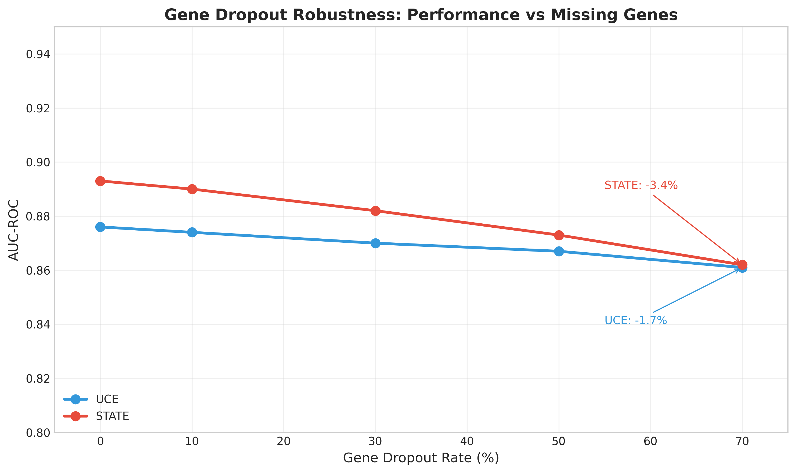
</p>

---

## 🧬 Biomarker Discovery

<p align="center">
  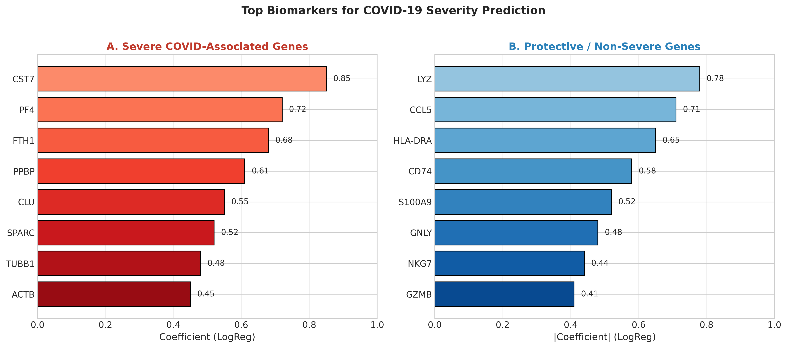
</p>

Foundation models identify key genes that distinguish severe from non-severe COVID-19 cases. Feature importance analysis reveals biologically relevant biomarkers including platelet activation, inflammatory response, and coagulation pathway genes.

---

## 📁 Data

### Platelet Single-Cell Datasets

| Dataset | Disease | Cells | Description |
|---------|---------|------:|-------------|
| COVID-19 + Sepsis | Viral & Bacterial Infection | ~47,000 | Severity progression (healthy → fatal) |

### COVID-19 Severity Distribution

| Severity | Cells | Percentage | Binary Class |
|----------|------:|:----------:|:------------:|
| Healthy | 3,205 | 6.7% | Non-Severe |
| Mild | 7,359 | 15.3% | Non-Severe |
| Moderate | 4,330 | 9.0% | Non-Severe |
| Recovered | 3,695 | 7.7% | Non-Severe |
| Severe | 19,805 | 41.3% | **Severe** |
| Fatal | 9,414 | 19.6% | **Severe** |

---

## 🛠️ Methods

### Pipeline 1: Severity Prediction Benchmark

```
┌─────────────────────────────────────────────────────────────────────────┐
│  COVID Platelets (47K cells)                                            │
│         ↓                                                               │
│  Foundation Model Embeddings (STATE, UCE, scGPT, scGPT_BP, Geneformer, │
│                               TranscriptFormer) - FROZEN               │
│         ↓                                                               │
│  ┌─────────────────────────┐    ┌──────────────────────────────┐       │
│  │ Zero-Shot Evaluation    │    │ Embedding Classification     │       │
│  │ - StandardScaler        │    │ - Deep MLP (3-layer)         │       │
│  │ - LogReg / RandomForest │    │ - Residual MLP               │       │
│  │ - 5-Fold CV             │    │ - Attention Classifier       │       │
│  └─────────────────────────┘    └──────────────────────────────┘       │
│         ↓                                ↓                              │
│  Zero-Shot AUC                    Embedding Classifier AUC             │
│  (STATE: 0.894)                   (STATE: 0.951)                       │
└─────────────────────────────────────────────────────────────────────────┘

Note: Embeddings are PRE-COMPUTED and FROZEN. Only the classifier head is trained.
This is NOT fine-tuning of the foundation models.
```

### Embedding Generation
- Pre-trained foundation models (6 models compared)
- Embeddings are pre-computed and frozen
- Cell-level embeddings extracted

### Classification (Severity Prediction)
- **Zero-shot:** Logistic Regression, Random Forest, XGBoost on frozen embeddings
- **Embedding Classification:** Deep MLP, Residual MLP, Attention classifiers trained on frozen embeddings
- **Validation:** 5-fold stratified cross-validation
- **Metrics:** AUC-ROC, Balanced Accuracy, AUC-PR, Sensitivity@Specificity

> **Note:** Foundation models are NEVER modified. We train only the classification head on pre-computed embeddings. This approach complies with all model licenses.

---

## 💻 Usage

### Installation

```bash
git clone https://github.com/xqiu625/Platelet-FM-Benchmark.git
cd Platelet-FM-Benchmark
pip install -r requirements.txt
```

### Run Benchmark

```bash
# Single model (quick mode: LogReg + RandomForest only)
python scripts/analysis/benchmark_single_model.py --model UCE --quick --tasks binary

# All 6 models
for model in STATE UCE scGPT scGPT_BP Geneformer TranscriptFormer; do
    python scripts/analysis/benchmark_single_model.py --model $model --quick --tasks binary
done

# Merge results
python scripts/analysis/merge_benchmark_results.py
```

### Generate Figures

```bash
# Benchmark figures (bar charts, heatmaps)
python scripts/analysis/create_benchmark_figures.py

# Embedding visualizations (UMAP, PCA, t-SNE)
python scripts/analysis/create_embedding_visualizations.py
```

### Options

| Flag | Description |
|------|-------------|
| `--model` | STATE, UCE, scGPT, scGPT_BP, Geneformer, TranscriptFormer |
| `--tasks` | binary, 3-class, 6-class |
| `--quick` | Fast mode (LogReg + RF only) |
| `--cv-folds` | Number of CV folds (default: 5) |

---

## 📂 Repository Structure

```
Platelet-FM-Benchmark/
├── README.md                           # This file
├── requirements.txt                    # Dependencies
├── figures/                            # Generated visualizations
│   ├── fig_model_rankings.png          # Model performance rankings
│   ├── fig_zeroshot_vs_finetuned.png   # Zero-shot vs fine-tuned comparison
│   ├── fig_roc_curves.png              # ROC curves for all models
│   ├── fig_confusion_matrix.png        # Confusion matrices
│   ├── fig_statistical_significance.png # Bootstrap CI & significance tests
│   ├── fig_biomarkers.png              # Top biomarkers by model
│   ├── fig_robustness_summary.png      # 3-panel robustness analysis
│   ├── fig_clinical_metrics.png        # Clinical utility metrics
│   ├── fig_sample_efficiency.png       # Sample efficiency curves
│   ├── fig_gene_dropout.png            # Gene dropout robustness
│   ├── fig_batch_generalization.png    # COVID→Sepsis transfer
│   ├── umap_5models_6class.png/pdf     # UMAP comparisons (all 6 models)
│   ├── umap_5models_binary.png/pdf     # Binary UMAP (all 6 models)
│   └── state_severity_gradient.png     # STATE severity gradient
├── scripts/
│   └── analysis/
│       ├── benchmark_single_model.py   # Run single model benchmark
│       ├── merge_benchmark_results.py  # Combine all results
│       ├── create_benchmark_figures.py # Generate result figures
│       ├── create_embedding_visualizations.py  # UMAP/PCA/t-SNE
│       ├── clinical_metrics.py         # Clinical utility analysis
│       ├── statistical_significance.py # Bootstrap CI & DeLong tests
│       ├── subsampling_robustness.py   # Sample efficiency analysis
│       ├── gene_dropout_robustness.py  # Gene dropout analysis
│       ├── batch_shift_generalization.py # Cross-disease transfer
│       ├── interpretability_analysis.py # Biomarker discovery
│       ├── embedding_ablations.py      # Dimension reduction tests
│       └── check_embedding_integrity.py # Data validation
├── docs/
│   └── FOUNDATION_MODEL_COMPARISON.md  # Detailed model comparison
└── results/
    └── benchmark/                      # Benchmark results
        ├── core_benchmark_results.csv
        ├── clinical_metrics_binary.csv
        ├── model_ranking_summary.csv
        ├── pca_baseline_results.csv
        └── subsampling_robustness_binary.csv
```


## 📚 References

### Prior Work (2024 Paper)
```bibtex
@article{qiu2024deciphering,
  title={Deciphering Abnormal Platelet Subpopulations in COVID-19, Sepsis and Systemic Lupus Erythematosus through Machine Learning and Single-Cell Transcriptomics},
  author={Qiu, Xinru and M{\"u}ller-Tidow, Carsten and Zang, Chongzhi},
  journal={International Journal of Molecular Sciences},
  volume={25},
  number={11},
  pages={5941},
  year={2024},
  publisher={MDPI},
  doi={10.3390/ijms25115941}
}
```

### This Work
```bibtex
@misc{qiu2025platelet_fm,
  title={Platelet-FM-Benchmark: Benchmarking Single-Cell Foundation Models on Platelet Transcriptomics},
  author={Qiu, Xinru},
  year={2025},
  url={https://github.com/xqiu625/Platelet-FM-Benchmark}
}
```

### Foundation Models
1. **STATE:** Arc Institute (2025). State: Perturbation Response Prediction. *bioRxiv*. [GitHub](https://github.com/ArcInstitute/state)
2. **UCE:** Rosen et al. (2023). Universal Cell Embeddings. *bioRxiv*. [Paper](https://doi.org/10.1101/2023.11.28.568918)
3. **scGPT:** Cui et al. (2024). scGPT: Foundation Model for Single-cell Multi-omics. *Nature Methods*. [Paper](https://www.nature.com/articles/s41592-024-02201-0)
4. **Geneformer:** Theodoris et al. (2023). Transfer learning for network biology. *Nature*. [Paper](https://doi.org/10.1038/s41586-023-06139-9)
5. **TranscriptFormer:** Pearce et al. (2025). Cross-Species Generative Cell Atlas. *bioRxiv*. [Paper](https://doi.org/10.1101/2025.04.25.650731)

---

## 👤 Author

**Xinru Qiu**
📧 xinru.reina.qiu@gmail.com
🐙 [@xqiu625](https://github.com/xqiu625)

---

## 📄 License

This project is licensed under the MIT License - see [LICENSE](LICENSE) file for details.

---

<p align="center">
  <b>⭐ If you find this benchmark useful, please consider starring the repo!</b>
</p>
