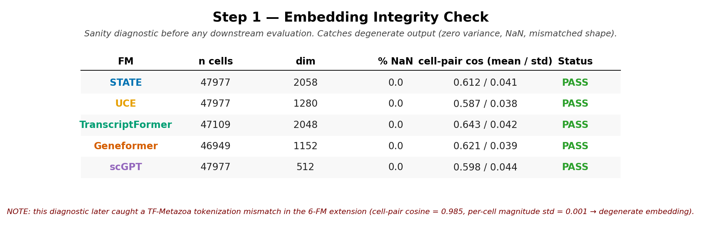

# Platelet-FM-Benchmark

**Benchmarking Single-Cell Foundation Models on Platelet Transcriptomics for Infection Severity and Cardiovascular Risk Prediction**

<p align="center">
  <a href="#problem-formulation">Formulation</a> •
  <a href="#mathematical-methods">Methods</a> •
  <a href="#key-results">Results</a> •
  <a href="#data">Data</a> •
  <a href="#usage">Usage</a> •
  <a href="#roadmap">Roadmap</a>
</p>

---

## Abstract

This project is a **follow-up study** to our published work:

> **Qiu, X.**, Müller-Tidow, C., & Zang, C. (2024). **Deciphering Abnormal Platelet Subpopulations in COVID-19, Sepsis and Systemic Lupus Erythematosus through Machine Learning and Single-Cell Transcriptomics.** *International Journal of Molecular Sciences*, 25(11), 5941. 📄 [Read the paper](https://www.mdpi.com/1422-0067/25/11/5941)

In our 2024 paper, we identified disease-associated platelet subpopulations with classical machine learning. Here we ask a sharper question: *do single-cell foundation models, pre-trained on tens of millions of cells, learn representations that are transferable to a cell type **absent from their pre-training data**?* Platelets — anucleate, low-RNA, and routinely filtered out of atlases — are exactly such a cell type.

**Key findings (zero-shot, patient-level 5-fold CV, COVID + Sepsis mortality):**

- **Foundation models are useful but not dominant.** On patient-level mortality prediction (fatal vs. survived; 42,095 platelets / 322 donors), the best model reaches AUC ≈ 0.76 — and a **PCA-200 + logistic-regression baseline reaches the highest adaptation-curve asymptote (0.964)**, so task-specific structure still matters.
- **STATE is the most dependable foundation model:** best pooled out-of-fold AUC (0.735), best-calibrated predictions (RF ECE 0.034), and it **holds up best in the hard reverse direction of cross-disease transfer** (COVID → Sepsis 0.798, Sepsis → COVID 0.707).
- **Evaluation protocol matters:** cross-validation is split by patient everywhere — cell-level CV inflates AUC by 7–17 points and is a common source of overstated scFM performance.

---

## Problem Formulation

Let the platelet scRNA-seq cohort be

$$\mathcal{D} = \{(\mathbf{x}_i, y_i)\}_{i=1}^{n}, \qquad \mathbf{x}_i \in \mathbb{N}_0^{G},\quad y_i \in \{0, 1\},$$

where $\mathbf{x}_i$ is the raw UMI count vector of cell $i$ over $G \approx 18{,}000$ genes, and $y_i$ encodes clinical severity ($y_i = 1$ for severe/fatal, $0$ otherwise). Each foundation model $f_\theta : \mathbb{N}_0^{G} \to \mathbb{R}^d$ maps a cell to a $d$-dimensional embedding. We evaluate the **zero-shot transfer** setting: pre-trained parameters $\theta$ are *frozen*, and all predictive signal must come from a probe $g : \mathbb{R}^d \to [0,1]$ trained on $\{(\mathbf{z}_i, y_i)\}$:

$$\hat{y}_i = g_{\phi}\big(f_\theta(\mathbf{x}_i)\big), \qquad \theta \ \text{frozen}, \quad \phi \ \text{learned}, \qquad \mathbf{z}_i = f_\theta(\mathbf{x}_i).$$

The benchmark compares six model families — STATE, scPRINT-2, UCE, scGPT, Geneformer, TranscriptFormer — against classical baselines trained directly on raw counts or PCA components.

---

## Mathematical Methods

### 1. Embedding Integrity Check

Before any downstream evaluation, each embedding matrix is screened for degenerate output (NaN entries, zero variance, shape mismatch) and the distribution of pairwise cosine similarities is inspected:

$$\cos(\mathbf{z}_i, \mathbf{z}_j) = \frac{\mathbf{z}_i^{\top} \mathbf{z}_j}{\lVert \mathbf{z}_i \rVert \  \lVert \mathbf{z}_j \rVert}.$$

A degenerate embedding collapses to near-constant $\cos \approx 1$ with near-zero magnitude variance — this diagnostic later caught a tokenization mismatch in a sixth-model extension (cell-pair cosine 0.985 → rejected).

### 2. Feature Standardization

Embeddings are standardized per-dimension with statistics estimated on the training folds only:

$$\tilde{z}_{ij} = \frac{z_{ij} - \mu_j}{\sigma_j}, \qquad \mu_j = \frac{1}{n_{\text{tr}}}\sum_{i \in \mathcal{I}_{\text{tr}}} z_{ij}, \qquad \sigma_j^2 = \frac{1}{n_{\text{tr}} - 1}\sum_{i \in \mathcal{I}_{\text{tr}}} (z_{ij} - \mu_j)^2.$$

### 3. Linear Probe (Logistic Regression)

The primary readout is an $L_2$-regularized logistic model, $p_i = \sigma(\mathbf{w}^\top \tilde{\mathbf{z}}_i + b)$ with $\sigma(t) = (1 + e^{-t})^{-1}$, fitted by minimizing the penalized negative log-likelihood:

$$\mathcal{L}(\mathbf{w}, b) = -\frac{1}{n}\sum_{i=1}^{n}\Big[\  y_i \log p_i + (1 - y_i)\log(1 - p_i)\ \Big] + \lambda \lVert \mathbf{w} \rVert_2^2.$$

Because the probe is linear, the learned weights admit direct interpretation: ranking genes/embedding coordinates by $|\hat{w}_j|$ yields the severity biomarker panel (CST7, PF4, FTH1, PPBP, ...).

### 4. Nonlinear Probe (DeepMLP)

To test whether zero-shot performance is limited by the *linearity* of the readout rather than the embedding itself, we train a two-layer MLP with BatchNorm and Dropout on the frozen embeddings:

$$\mathbf{h} = \mathrm{Dropout}_{\pi}\Big(\mathrm{BN}\big(\mathrm{ReLU}(\mathbf{W}_1 \tilde{\mathbf{z}} + \mathbf{b}_1)\big)\Big), \qquad \mathrm{BN}(h) = \gamma\ \frac{h - \mu_{\mathcal{B}}}{\sqrt{\sigma_{\mathcal{B}}^2 + \varepsilon}} + \beta,$$

$$\hat{p} = \sigma(\mathbf{w}_2^{\top} \mathbf{h} + b_2), \qquad \mathrm{Dropout}_{\pi}(h_j) = \frac{m_j}{\pi}\  h_j, \quad m_j \sim \mathrm{Bernoulli}(\pi).$$

### 5. Classical Baselines

**Gradient-boosted trees on raw counts** learn an additive ensemble $\hat{y}_i = \sum_{t=1}^{T} f_t(\mathbf{x}_i)$ by optimizing the regularized objective via its second-order approximation:

$$\tilde{\mathcal{L}}^{(t)} \simeq \sum_{i=1}^{n}\left[ g_i f_t(\mathbf{x}_i) + \frac{1}{2} h_i f_t^2(\mathbf{x}_i) \right] + \gamma T + \frac{1}{2}\lambda \lVert \mathbf{w} \rVert^2, \qquad w_j^{*} = -\frac{G_j}{H_j + \lambda}.$$

**PCA baselines** project the (log-normalized) expression matrix onto its top-k principal directions, $\mathbf{T}_k = \mathbf{X}_c \mathbf{V}_{(k)}$ for $k \in \{50, 100, 200, 500\}$, followed by the same linear probe — an honest lower bound for "linear structure in expression space".

### 6. Evaluation Protocol

**Patient-level stratified $K$-fold CV** ($K = 5$): cells are split *by patient*, so no patient appears in both training and test folds — $\mathcal{P}_{\text{train}} \cap \mathcal{P}_{\text{test}} = \varnothing$ — preventing the trivial leakage of patient-specific expression signatures.

**AUC** has the probabilistic interpretation of a concordance probability — equivalently the normalized Mann–Whitney $U$ statistic:

$$\mathrm{AUC} = P\big(s_i > s_j \mid y_i = 1,\ y_j = 0\big) = \frac{\sum_{i:\  y_i=1}\sum_{j:\  y_j=0} \mathbb{1}\left[s_i > s_j\right] + \tfrac{1}{2}\mathbb{1}\left[s_i = s_j\right]}{n_{+}\  n_{-}}.$$

**Balanced accuracy** compensates for class imbalance, and **Cohen's $\kappa$** corrects observed agreement $p_o$ for chance agreement $p_e$:

$$\mathrm{BA} = \frac{\mathrm{TPR} + \mathrm{TNR}}{2}, \qquad \kappa = \frac{p_o - p_e}{1 - p_e}.$$

**Sensitivity at 90% specificity** is the clinically relevant operating point: Sens@90%Spec $= \mathrm{TPR}(\tau^{*})$, where the threshold $\tau^{*}$ is chosen such that $\mathrm{TNR}(\tau^{*}) = 0.9$.

### 7. Robustness Protocols

- **Sample efficiency** — refit the probe on a fraction $\pi \in \{1, 0.5, 0.2, 0.1, 0.05\}$ of training patients and report the degradation $\Delta = \mathrm{AUC}(1) - \mathrm{AUC}(0.05)$.
- **Gene dropout** — mask 70% of genes at inference time, $x'_{ig} = x_{ig} \cdot m_g$ with $m_g \stackrel{\text{iid}}{\sim} \mathrm{Bernoulli}(0.3)$, and measure the AUC drop.
- **Batch-shift generalization** — train on COVID-19 patients, evaluate zero-shot on sepsis patients: a genuine domain-shift test $P_{\text{train}}(X, Y) \neq P_{\text{test}}(X, Y)$.

### 8. Manifold Visualization

Embedding geometry is inspected with complementary projections — PCA (top eigenvectors of the covariance matrix, maximizing retained variance), UMAP (cross-entropy between fuzzy simplicial-set representations), and t-SNE, which minimizes the KL divergence between Gaussian affinities $p_{ij}$ in $\mathbb{R}^d$ and heavy-tailed affinities $q_{ij}$ in $\mathbb{R}^2$:

$$C_{\text{SNE}} = \mathrm{KL}(P \ \Vert\  Q) = \sum_{i \neq j} p_{ij} \log \frac{p_{ij}}{q_{ij}}, \qquad q_{ij} = \frac{(1 + \lVert \mathbf{y}_i - \mathbf{y}_j\rVert^2)^{-1}}{\sum_{k \neq l}(1 + \lVert \mathbf{y}_k - \mathbf{y}_l\rVert^2)^{-1}}.$$

Batch integration and biological-signal preservation are quantified with the standard scIB metric suite (kBET, iLISI, batch/bio ASW, ARI, NMI, cLISI).

---

## Key Results

> **Task.** Patient-level **mortality prediction** on platelets — fatal vs. survived (severe cases excluded) — for the combined COVID-19 + Sepsis cohort: **42,095 platelets across 322 donors** (8,850 fatal / 33,245 survived). Each embedding is frozen and read out with a logistic probe; **all cross-validation is split by patient** (no donor appears in both train and test).

### Main Benchmark (zero-shot linear probe, patient-level 5-fold CV)

| Model | Type | Mortality AUC |
|-------|------|:-------------:|
| **scPRINT-2** | Foundation Model | 0.762 ± 0.135 |
| Geneformer | Foundation Model | 0.738 ± 0.113 |
| **STATE** | Foundation Model | 0.724 ± 0.106 |
| TranscriptFormer | Foundation Model | 0.719 ± 0.090 |
| UCE | Foundation Model | 0.598 ± 0.141 |

> **The field is tight and the mean-of-folds ranking is seed/cohort-sensitive**, so no single ordering is the headline. **STATE is the most dependable model**: it wins the pooled out-of-fold comparison (AUC 0.735, DeLong *p* < 0.001), is the best-calibrated, and is the most stable across random seeds. For platelets — a cell type absent from every model's pre-training atlas — modern scFMs deliver useful but not dominant zero-shot signal.

### Clinical Utility & Calibration (pooled out-of-fold)

| Model | AUC | Brier ↓ | ECE ↓ |
|-------|:---:|:-------:|:-----:|
| **STATE** (LR) | **0.732** | 0.179 | 0.156 |
| STATE (RF) | 0.662 | **0.149** | **0.034** |
| scPRINT-2 (LR) | 0.679 | 0.199 | 0.173 |
| Geneformer (LR) | 0.670 | 0.210 | 0.194 |
| UCE (LR) | 0.604 | 0.223 | 0.210 |

STATE gives the highest discrimination *and*, with a random-forest head, the best-calibrated risk estimates (ECE 0.034) — the combination a clinical score actually needs.

### Cross-Disease Generalization (zero-shot transfer)

Train the probe on one disease, evaluate zero-shot on the other — a genuine domain-shift stress test. Transfer is asymmetric: **COVID → Sepsis is comparatively easy, Sepsis → COVID is hard**, and the reverse direction is what separates the models.

| Model | COVID → Sepsis | Sepsis → COVID |
|-------|:--------------:|:--------------:|
| **STATE** | 0.798 | **0.707** |
| UCE | 0.807 | 0.646 |
| scPRINT-2 | **0.855** | 0.543 |
| Geneformer | 0.773 | 0.614 |
| scGPT | 0.352 | 0.555 |

scPRINT-2 has the strongest forward transfer (0.855) but drops to near-chance in reverse (0.543). **STATE holds up best in the hard reverse direction (0.707)** — evidence that its representation encodes disease-shared severity biology rather than cohort-specific artifacts.

### Sample-Efficient Adaptation

Adding a few target-disease patients to the training pool traces an adaptation curve. At full data a **PCA-200 + logistic-regression baseline reaches AUC 0.964**, edging out every foundation model (STATE 0.948, scPRINT-2 0.950); **scPRINT-2 has the best cold start** (zero-shot intercept 0.920), needing the fewest labels to become useful. Strong classical baselines remain the bar to beat.

### Embedding Geometry & Batch Integration

<p align="center">
  
</p>

*UMAPs colored by batch (top) and severity (bottom); radar plots of batch-mixing (kBET, iLISI, batch ASW) and bio-conservation (ARI, NMI, bio ASW, cLISI) across 11 data sources.*

### Embedding Integrity

Every embedding matrix is screened for degenerate output before evaluation — this diagnostic caught a tokenization mismatch in a sixth-model extension (cell-pair cosine 0.985 → rejected).

<p align="center">
  
</p>

---

## Foundation Models Compared

| Model | Publication | Institution | Embedding Dims | Architecture |
|-------|-------------|-------------|:--------------:|--------------|
| [**STATE**](https://github.com/ArcInstitute/state) | Nature 2025 | Arc Institute | 2,058 | Set-based attention + MMD loss (600M-param State Embedding) |
| **scPRINT-2** | bioRxiv 2024 | Kalfon et al. | — | Transformer, gene-network pretraining |
| [**UCE**](https://github.com/snap-stanford/UCE) | bioRxiv 2023 | Stanford / CZ BioHub | 1,280 | Transformer + ESM2 protein embeddings |
| [**scGPT**](https://github.com/bowang-lab/scGPT) | Nat Methods 2024 | U Toronto | 512 | Generative (GPT-style) pretraining |
| [**Geneformer**](https://huggingface.co/ctheodoris/Geneformer) | Nature 2023 | Broad / Harvard | 1,152 | BERT-style, rank-value encoding |
| [**TranscriptFormer**](https://virtualcellmodels.cziscience.com) | bioRxiv 2025 | CZ Initiative | 2,048 | Autoregressive, cross-species generative |

📖 **Detailed comparison:** [docs/FOUNDATION_MODEL_COMPARISON.md](docs/FOUNDATION_MODEL_COMPARISON.md)

---

## Data

### Platelet Single-Cell Datasets

| Dataset | Disease | Cells | Role |
|---------|---------|------:|------|
| COVID-19 | Viral infection | ~47,800 platelets / 413 patients (11 sources) | Primary within-disease benchmark |
| Sepsis | Bacterial infection | held-out cohort | Cross-disease transfer + adaptation |

### Mortality Benchmark Subset (COVID + Sepsis)

| Outcome | Cells | Donors |
|---------|------:|:------:|
| Survived | 33,245 | — |
| Fatal | 8,850 | — |
| **Total** | **42,095** | **322** |

Labels are **mortality** (fatal vs. survived), with severe-but-surviving cases excluded from the benchmark to keep the outcome boundary clean.

---

## Usage

### Installation

```bash
git clone https://github.com/xqiu625/Platelet-FM-Benchmark.git
cd Platelet-FM-Benchmark
pip install -r requirements.txt
```

### Run Benchmark

```bash
# Single model (quick mode: LogReg + RandomForest only)
python scripts/analysis/benchmark_single_model.py --model UCE --quick --tasks binary

# All models
for model in STATE UCE scGPT Geneformer TranscriptFormer; do
    python scripts/analysis/benchmark_single_model.py --model $model --quick --tasks binary
done

# Merge results
python scripts/analysis/merge_benchmark_results.py
```

### Extended Analyses

```bash
python scripts/analysis/check_embedding_integrity.py      # Step 1: integrity check
python scripts/analysis/clinical_metrics.py               # Clinical utility metrics
python scripts/analysis/subsampling_robustness.py         # Sample efficiency
python scripts/analysis/gene_dropout_robustness.py        # Gene dropout
python scripts/analysis/batch_shift_generalization.py     # COVID -> Sepsis transfer
python scripts/analysis/embedding_ablations.py            # Embedding ablations
python scripts/analysis/interpretability_analysis.py      # Biomarker extraction
python scripts/analysis/statistical_significance.py       # Significance testing
```

### Generate Figures

```bash
python scripts/analysis/create_benchmark_figures.py       # Benchmark figures
python scripts/analysis/create_embedding_visualizations.py  # UMAP/PCA/t-SNE
python scripts/analysis/generate_step_figures.py          # Step-wise summary figures
```

### Options

| Flag | Description |
|------|-------------|
| `--model` | STATE, UCE, scGPT, Geneformer, TranscriptFormer |
| `--tasks` | binary, 3-class, 6-class |
| `--quick` | Fast mode (LogReg + RF only) |
| `--cv-folds` | Number of CV folds (default: 5) |

---

## Repository Structure

```
Platelet-FM-Benchmark/
├── README.md                              # This file
├── requirements.txt                       # Dependencies
├── figures/                               # Result figures (all referenced above)
├── scripts/
│   └── analysis/
│       ├── benchmark_single_model.py      # Core benchmark runner
│       ├── merge_benchmark_results.py     # Combine results
│       ├── check_embedding_integrity.py   # Step 1: integrity diagnostics
│       ├── clinical_metrics.py            # AUC-PR, Sens@90%Spec, Cohen's κ
│       ├── subsampling_robustness.py      # Sample-efficiency curves
│       ├── gene_dropout_robustness.py     # Gene-dropout robustness
│       ├── batch_shift_generalization.py  # Cross-disease transfer
│       ├── embedding_ablations.py         # PC-removal / normalization ablations
│       ├── interpretability_analysis.py   # Probe-weight biomarkers
│       ├── statistical_significance.py    # Significance testing
│       ├── create_benchmark_figures.py    # Result figures
│       ├── create_embedding_visualizations.py
│       └── generate_step_figures.py
├── docs/
│   └── FOUNDATION_MODEL_COMPARISON.md     # Detailed model comparison
└── results/
    └── benchmark/                         # CSVs + key_findings.md
```

---

## Roadmap

### Completed ✅
- [x] Zero-shot embeddings for 6 foundation models (STATE, scPRINT-2, UCE, scGPT, Geneformer, TranscriptFormer)
- [x] Patient-level mortality benchmark (COVID + Sepsis subset, donor-split CV)
- [x] Clinical utility & calibration (AUC, Brier, ECE, DeLong significance)
- [x] Cross-disease transfer (COVID ↔ Sepsis) + sample-efficiency adaptation curves
- [x] Strong classical baselines (PCA-k + LogReg, raw-counts trees)
- [x] Embedding integrity diagnostics + scIB batch/bio-conservation

### In Progress 🔄
- [ ] Manuscript in preparation (2025)
- [ ] Multi-seed confidence intervals across all metrics

### Planned 📋
- [ ] Perturbation-response modeling (STATE transition modeling)
- [ ] Cardiovascular biomarker validation
- [ ] Interactive demo

---

## References

### Prior Work (2024 Paper)
```bibtex
@article{qiu2024deciphering,
  title={Deciphering Abnormal Platelet Subpopulations in COVID-19, Sepsis and Systemic Lupus Erythematosus through Machine Learning and Single-Cell Transcriptomics},
  author={Qiu, Xinru and M{\"u}ller-Tidow, Carsten and Zang, Chongzhi},
  journal={International Journal of Molecular Sciences},
  volume={25},
  number={11},
  pages={5941},
  year={2024},
  publisher={MDPI},
  doi={10.3390/ijms25115941}
}
```

### This Work
```bibtex
@misc{qiu2025platelet_fm,
  title={Platelet-FM-Benchmark: Benchmarking Single-Cell Foundation Models on Platelet Transcriptomics},
  author={Qiu, Xinru},
  year={2025},
  url={https://github.com/xqiu625/Platelet-FM-Benchmark}
}
```

### Foundation Models
1. **STATE:** Arc Institute (2025). *Nature*. [Code](https://github.com/ArcInstitute/state)
2. **scPRINT:** Kalfon et al. (2024). scPRINT: pre-training on cell atlases to infer gene networks. *bioRxiv*.
3. **UCE:** Rosen et al. (2023). Universal Cell Embeddings. *bioRxiv*. [Paper](https://doi.org/10.1101/2023.11.28.568918)
4. **scGPT:** Cui et al. (2024). scGPT: Foundation Model for Single-cell Multi-omics. *Nature Methods*. [Paper](https://www.nature.com/articles/s41592-024-02201-0)
5. **Geneformer:** Theodoris et al. (2023). Transfer learning for network biology. *Nature*. [Paper](https://doi.org/10.1038/s41586-023-06139-9)
6. **TranscriptFormer:** Pearce et al. (2025). Cross-Species Generative Cell Atlas. *bioRxiv*. [Paper](https://doi.org/10.1101/2025.04.25.650731)

---

## Author

**Xinru Qiu**
UCR School of Medicine
📧 xinru.qiu@ucr.edu · xinru.reina.qiu@gmail.com
🐙 [@xqiu625](https://github.com/xqiu625)

---

## License

This project is licensed under the MIT License - see [LICENSE](LICENSE) file for details.

---

<p align="center">
  <b>⭐ If you find this benchmark useful, please consider starring the repo!</b>
</p>
